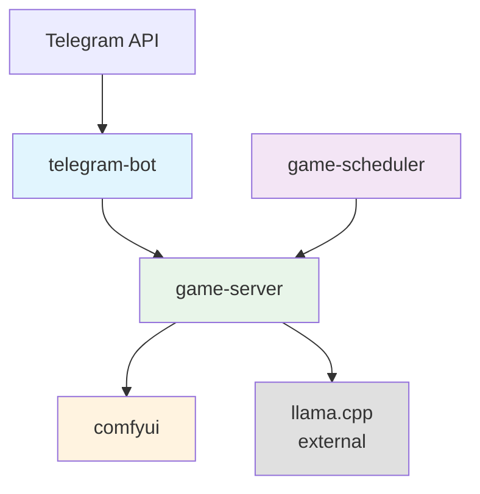

# AI Game Master

AI-powered cooperative game delivered through Telegram bot. Each turn, an AI generates a
unique story, personalized comics, and NPC interactions based on player choices.

## Architecture



## Services

| Service | Port | Description |
|---------|------|-------------|
| game-server | 8000 | FastAPI backend with SQLite persistence |
| telegram-bot | N/A | Telegram bot interface |
| comfyui | 8188 | Image/Video generation backend |
| game-scheduler | N/A | Turn generation scheduler (run manually for debugging) |

### Game Master API (`game-server/`)

FastAPI service that orchestrates the game:

- Turn story generation using OpenAI API
- NPC dialogue generation
- Personalized comic generation via ComfyUI
- Player action processing
- Text/voice message handling
- SQLite persistence for game state

**Ports:** 8000

**Key Endpoints:**

- `POST /onboarding/start` - Start onboarding for a player
- `POST /onboarding/{session_id}/answer` - Submit onboarding answer
- `GET /players/{player_id}/profile` - Get player profile
- `GET /game/current-turn` - Get current turn's episode
- `POST /game/actions` - Submit player action
- `POST /game/messages` - Send message to game master
- `POST /admin/generate-turn` - Generate new turn episode
- `POST /admin/generate-comic/{player_id}` - Generate personalized comic

### Telegram Bot (`telegram-bot/`)

Player interface via Telegram:

- `/start` - Begin onboarding or return to game
- `/profile` - Show player role and traits
- `/turn` - View current turn episode
- `/help` - Show help information
- Interactive keyboards for action selection
- Voice message support
- Text chat with Game Master

**Ports:** None (outbound Telegram API only)

### Game Master Scheduler (`game-scheduler/`)

Scheduled task runner that triggers daily episode generation. Can be run manually for debugging.

**Usage:**

```bash
# Run single generation cycle for testing
GAME_SCHEDULER_MODE=single docker compose run --rm game-scheduler
```

**Ports:** None

### ComfyUI (`comfyui/`)

Image/video/3D generation backend. Requires GPU.

**Ports:** 8188

## Setup

### Prerequisites

- Docker and Docker Compose
- NVIDIA GPU (for ComfyUI)
- NVIDIA Container Toolkit
- Telegram Bot Token (get from @BotFather)
- External `spark-network` Docker network
- External `llama.cpp` service running on port 8090

### Configuration

1. Copy `.env.example` to `.env`:

```bash
cp .env.example .env
```

1. Edit `.env` and set your Telegram bot token:

```env
TELEGRAM_BOT_TOKEN=your_bot_token_here
```

### Running the Services

1. Build and start services:

```bash
docker compose up -d
```

1. Check logs:

```bash
docker compose logs -f game-server
docker compose logs -f telegram-bot
```

1. Run single generation cycle (for testing):

```bash
GAME_SCHEDULER_MODE=single docker compose run --rm game-scheduler
```

## Onboarding Flow

1. Player sends `/start` to the bot
2. Bot creates onboarding session
3. Player answers 5 behavioral questions:
   - Response to unknown signals
   - Handling risky plans
   - Moral dilemmas
   - Specialization preference
   - Conflict resolution style
4. System generates player profile:
   - Role (Chief Engineer, XO, Science Officer)
   - Personality traits
   - Avatar description

## Turn Game Loop

```text
08:00  - Game Master generates turn episode
08:30  - Players receive notification with setup
08:00-20:00 - Players vote on actions
20:00  - Outcome determination
20:30  - Content generation (comics, images)
21:00  - Publish results and teaser for tomorrow
```

## NPC System

The system generates NPC teams based on player role:

- **Captain** - Always present, leads the crew
- **Pilot** - Navigation and flight operations
- **Engineer** - Technical systems maintenance
- **Communications** - External contact and diplomacy
- **Science Officer** - Research and analysis
- **Security Chief** - Safety and threat assessment

NPCs have distinct personalities and speech styles.

## Content Generation

### Personalized Comics

- Generated per player based on their role and traits
- 4-6 panel format
- Includes player character prominently
- Speech bubbles with NPC dialogue

### Image Generation

- Scene images for story settings
- Character portraits
- 3D scene descriptions

## Development

### Running Locally

```bash
# Game Master API
cd game-server
pip install -r requirements.txt
uvicorn main:app --reload --host 0.0.0.0 --port 8000

# Telegram Bot
cd telegram-bot
pip install -r requirements.txt
export TELEGRAM_BOT_TOKEN=your_token
python bot.py

# Game Master (for debugging)
cd game-scheduler
pip install -r requirements.txt
GAME_SCHEDULER_MODE=single python game_server.py
```

After running this, you must generate a new turn via Telegram:

### Running Tests

Activate the project virtual environment and run:

```bash
cd game-server && ../.venv/bin/python -m unittest discover -s tests
```

Or specific modules:

```bash
cd game-server && ../.venv/bin/python -m unittest tests.test_game_rules tests.test_mission_db
```

## API Documentation

Visit `http://localhost:8000/docs` for Swagger UI.

## Troubleshooting

### API Connection Failed

Check game-server health:

```bash
curl http://localhost:8000/health
docker compose logs game-server
```

### GPU Not Available

```bash
docker compose logs comfyui
# Check if NVIDIA runtime is configured
nvidia-smi
```

### Telegram Bot Not Responding

```bash
# Check if bot token is set
docker compose exec telegram-bot env | grep TELEGRAM
# Verify API connectivity
docker compose exec telegram-bot ping game-server
```

## Configuration Details

| Variable | Default | Description |
| ---------- | --------- | ------------- |
| LLM_URL | <http://llama.cpp:8090/v1> | LLM endpoint |
| LLM_API_KEY | placeholder-key-for-llama-cpp | Required by OpenAI client |
| COMFYUI_URL | <http://comfyui:8188> | Image gen endpoint |
| TELEGRAM_BOT_TOKEN | (required) | Telegram bot token |
| GAME_SCHEDULE | 8h | Turn schedule: Nh/Nm/Ns, HH:MM, HH:MM,..., DAY-HH:MM |
| GAME_SCHEDULER_MODE | scheduled | single/simulation/scheduled |

## Future Enhancements

- [ ] SQLite persistence (in progress)
- [ ] Redis for task queue
- [ ] Voice message transcription
- [ ] 3D scene generation
- [ ] Video clips for key moments
- [ ] Multi-player cooperation
- [ ] Cross-group events
- [ ] Telegram Mini App integration
