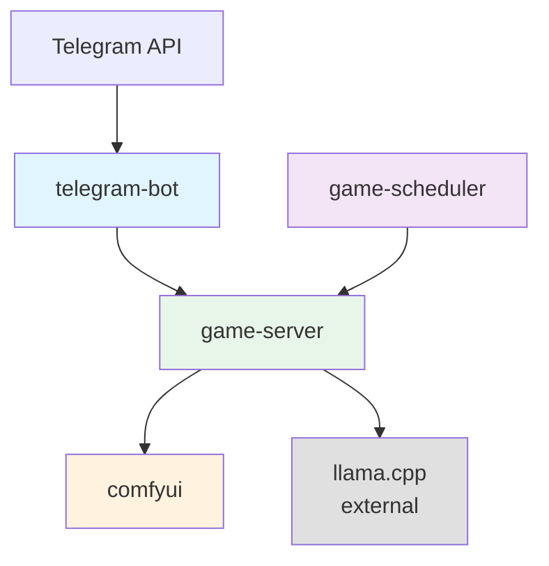
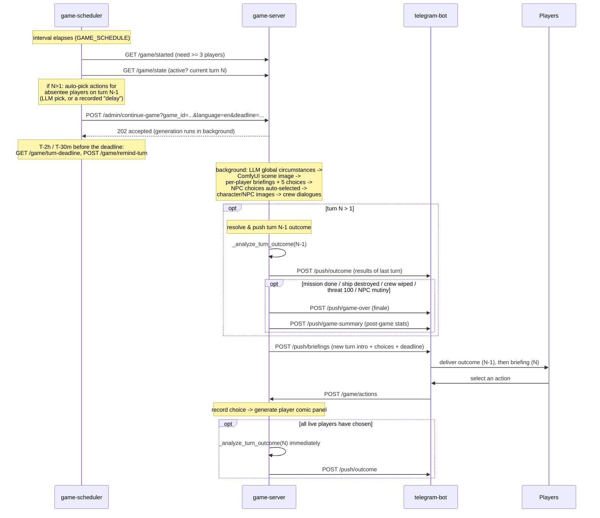

# AI Game Master

AI-powered cooperative game delivered through Telegram bot. Each turn, an AI generates a
unique story, personalized comics, and NPC interactions based on player choices.

The game is finite and can be lost. A doom clock (threat level 0-100) ticks every turn
(+8 base, accelerated by hesitations, a critically damaged hull and mission stagnation) —
at 100 the game ends. Hull damage accumulates turn over turn (hull 0 = ship destroyed),
wounds escalate minor → moderate → critical (critical + any new wound kills), NPC loyalty
drops with losses and can end in mutiny, and the crew is never replenished. The final
verdict is computed by code from the end-state into five outcomes: triumph / victory /
pyrrhic / stalemate / defeat.

## Architecture


```mermaid
graph TD
    A[Telegram API] --> B[telegram-bot]
    B --> C[game-server]
    D[game-scheduler] --> C
    C --> E[comfyui]
    C --> G[llama.cpp<br/>external]

    style B fill:#E1F5FE
    style C fill:#E8F5E9
    style E fill:#FFF3E0
    style G fill:#E0E0E0
    style D fill:#F3E5F5
```

## Services

| Service | Port | Description |
|---------|------|-------------|
| game-server | 8000 | FastAPI backend with SQLite persistence |
| telegram-bot | N/A | Telegram bot interface |
| comfyui | 8188 | Image/Video generation backend |
| game-scheduler | N/A | Turn generation scheduler (run manually for debugging) |

### Game Master API (`game-server/`)

FastAPI service that orchestrates the game:

- Turn story generation using OpenAI API
- NPC dialogue generation
- Personalized comic generation via ComfyUI
- Player action processing
- Text/voice message handling
- SQLite persistence for game state

**Ports:** 8000

**Key Endpoints:**

- `POST /onboarding/start` - Start onboarding for a player
- `POST /onboarding/{session_id}/answer` - Submit onboarding answer
- `GET /players/{player_id}/profile` - Get player profile
- `GET /game/current-turn` - Get current turn's episode
- `GET /game/turn-deadline/{game_id}` - Get the playable turn's deadline
- `POST /game/remind-turn/{game_id}/{turn}` - Send a T-2h/T-30m reminder
- `POST /game/actions` - Submit player action
- `POST /game/messages` - Send message to game master
- `POST /admin/continue-game` - Generate the next turn
- `GET /admin/win-rate` - Outcome telemetry over ended games
- `POST /admin/generate-comic/{player_id}` - Generate personalized comic

### Telegram Bot (`telegram-bot/`)

Player interface via Telegram:

- `/start` - Begin onboarding or return to game
- `/profile` - Show player role and traits
- `/turn` - View current turn episode
- `/help` - Show help information
- Interactive keyboards for action selection
- Voice message support
- Text chat with Game Master

**Ports:** None (outbound Telegram API only)

### Game Master Scheduler (`game-scheduler/`)

Scheduled task runner that triggers daily episode generation. Can be run manually for debugging.

**Usage:**

```bash
# Run single generation cycle for testing
GAME_SCHEDULER_MODE=single docker compose run --rm game-scheduler
```

**Ports:** None

### ComfyUI (`comfyui/`)

Image/video/3D generation backend. Requires GPU.

**Ports:** 8188

## Setup

### Prerequisites

- Docker and Docker Compose
- NVIDIA GPU (for ComfyUI)
- NVIDIA Container Toolkit
- Telegram Bot Token (get from @BotFather)
- External `spark-network` Docker network
- External `llama.cpp` service running on port 8090

### Configuration

1. Copy `.env.example` to `.env`:

```bash
cp .env.example .env
```

1. Edit `.env` and set your Telegram bot token:

```env
TELEGRAM_BOT_TOKEN=your_bot_token_here
```

### Running the Services

1. Build and start services:

```bash
docker compose up -d
```

1. Check logs:

```bash
docker compose logs -f game-server
docker compose logs -f telegram-bot
```

1. Run single generation cycle (for testing):

```bash
GAME_SCHEDULER_MODE=single docker compose run --rm game-scheduler
```

## Onboarding Flow

1. Player sends `/start` to the bot
2. Bot creates onboarding session
3. Player answers 5 behavioral questions:
   - Response to unknown signals
   - Handling risky plans
   - Moral dilemmas
   - Specialization preference
   - Conflict resolution style
4. System generates player profile:
   - Role (Chief Engineer, XO, Science Officer)
   - Personality traits
   - Avatar description

## Turn Game Loop

A turn is driven by `game-scheduler` (the timer), produced by `game-server`
(LLM + image orchestration), and delivered to players by `telegram-bot` (its
push server on port 9090). There is no fixed daily clock — turns are generated
on a configurable interval (`GAME_SCHEDULE`, default `8h`), and the previous
turn's outcome is published the moment all live players have chosen their
actions. Each turn has a deadline shown to players («Ход закроется: ...» UTC);
the scheduler sends T-2h/T-30m reminders and auto-picks actions for absentees
when the deadline passes.


```mermaid
sequenceDiagram
    participant S as game-scheduler
    participant GS as game-server
    participant TB as telegram-bot
    participant P as Players

    Note over S: interval elapses (GAME_SCHEDULE)
    S->>GS: GET /game/started   (need >= 3 players)
    S->>GS: GET /game/state     (active? current turn N)
    Note over S: if N>1: auto-pick actions for<br/>absentee players on turn N-1<br/>(LLM pick, or a recorded "delay")
    S->>GS: POST /admin/continue-game?game_id=...&language=en&deadline=...
    GS-->>S: 202 accepted (generation runs in background)

    Note over S: T-2h / T-30m before the deadline:<br/>GET /game/turn-deadline, POST /game/remind-turn

    Note over GS: background: LLM global circumstances -><br/>ComfyUI scene image -><br/>per-player briefings + 5 choices -><br/>NPC choices auto-selected -><br/>character/NPC images -> crew dialogues

    opt turn N > 1
        Note over GS: resolve & push turn N-1 outcome
        GS->>GS: _analyze_turn_outcome(N-1)
        GS->>TB: POST /push/outcome   (results of last turn)
        opt mission done / ship destroyed / crew wiped /<br/>threat 100 / NPC mutiny
            GS->>TB: POST /push/game-over  (finale)
            GS->>TB: POST /push/game-summary  (post-game stats)
        end
    end

    GS->>TB: POST /push/briefings  (new turn intro + choices + deadline)
    TB->>P: deliver outcome (N-1), then briefing (N)

    P->>TB: select an action
    TB->>GS: POST /game/actions
    Note over GS: record choice -> generate player comic panel
    opt all live players have chosen
        GS->>GS: _analyze_turn_outcome(N) immediately
        GS->>TB: POST /push/outcome
    end
```

### Per-turn sequence (on `game-server`)

1. **Trigger** — `game-scheduler` fires `POST /admin/continue-game`. The
   endpoint returns `202` immediately; all generation runs in the background.
2. **Global circumstances** — LLM produces the turn's setting, narrative,
   conflict and a scene prompt.
3. **Scene image** — ComfyUI renders the turn's scene from that prompt.
4. **Briefings & choices** — every live player and NPC gets a personalized
   briefing with **5 action choices** with hidden consequence kinds in a fixed
   quota — **2 progress / 2 injury / 1 fatal** (configurable via
   `GAME_TURN_PROGRESS_ACTIONS` / `GAME_TURN_INJURY_ACTIONS` /
   `GAME_TURN_FATAL_ACTIONS`). NPC choices are auto-selected by the LLM;
   players' choices stay open until the turn deadline.
5. **Character & NPC images** — ComfyUI renders per-player character images
   (each player's avatar as reference) and NPC action images.
6. **Crew dialogues** — LLM generates NPC banter for the turn.
7. **Game state advances** — the turn record is created (with its deadline),
   state moves to turn `N+1`.
8. **Previous turn outcome** (turn `N > 1`) — `_analyze_turn_outcome(N-1)`
   combines every player + NPC decision into one outcome narrative, applies the
   LLM's **ship deltas** (hull/shields/systems) to the persistent ship state,
   resolves wounds and deaths by `entity_id` through the rules ladder,
   ticks the doom clock and NPC loyalty, generates an outcome scene image,
   then pushes `/push/outcome`. The outcome risk is reweighted by code
   (damaged hull / high threat / reckless choices make catastrophes likelier).
   If the game ends (mission complete, hull 0, crew wiped, threat 100, or NPC
   mutiny), the code-computed verdict (triumph / victory / pyrrhic / stalemate /
   defeat) drives a finale pushed via `/push/game-over`, followed by a
   post-game stats summary via `/push/game-summary`.
9. **New turn delivery** — `/push/briefings` sends the new turn's intro,
   choices and deadline to each player. (Outcomes of `N-1` are always delivered
   *before* the briefing for `N`.)

### Action selection & outcome resolution

- Players pick an action in the bot → `POST /game/actions`. The server records
  the choice and kicks off a **comic panel** of that player performing the
  action (avatar as reference).
- The moment **all live players** have chosen, the outcome is analyzed
  immediately — it does not wait for the next scheduled tick. (The per-turn
  outcome analysis is idempotent, so a turn already resolved on time is a no-op
  at the start of the next turn.)
- Absentee players are handled by `game-scheduler`: at the start of turn `N` it
  auto-selects an action for anyone who did not choose on turn `N-1`
  (`POST /game/auto-action/{player}/{turn}`, LLM-picked) before triggering the
  next turn. If the LLM pick fails, a **delay** (hesitation) is recorded
  honestly: it does not advance the mission and accelerates the doom clock.

### Manual control (Game Master)

- `/gm_start <game_id>` — generate the **first** turn (`POST /admin/start-game`).
- `/gm_continue <game_id>` — generate the **next** turn immediately
  (`POST /admin/continue-game`), bypassing the scheduler.
- `/gm_turn <game_id>` — regenerate the current turn (`/admin/regenerate-turn`).
- `/gm_restart <game_id>`, `/gm_pause`, `/gm_schedule`, `/gm_status`,
  `/gm_kick`, `/gm_list`, `/gm_lang` — additional game management commands.

## NPC System

At game start, free seats are filled with a bounded pool of **exactly up to 4
NPCs** (`NPC_COUNT`), preferring the key roles `chief_engineer`,
`medical_officer`, `pilot` and `science_officer`. A bounded pool keeps the
crew-wipe ending reachable — and since a kicked or dead player's seat is never
refilled, every loss is permanent.

- **Chief Engineer** - Technical systems maintenance
- **Medical Officer** - Crew health and wound treatment
- **Pilot** - Navigation and flight operations
- **Science Officer** - Research and analysis

NPCs have distinct personalities and speech styles. Each NPC also has a
**loyalty** score (0-100, starting at 70) maintained by code: deaths, heavy
hull damage and mission regressions lower it; progress and healing raise it.
Loyalty is visible to players in `/game/team` (loyalty band) and shapes NPC
decisions. When **two or more active NPCs drop to loyalty <= 15, the crew
mutinies** — one of the five ways the game can end.

## Content Generation

### Personalized Comics

- Generated per player based on their role and traits
- 4-6 panel format
- Includes player character prominently
- Speech bubbles with NPC dialogue

### Image Generation

- Scene images for story settings
- Character portraits
- 3D scene descriptions

## Development

### Running Locally

```bash
# Game Server API
cd game-server
pip install -r requirements.txt
uvicorn main:app --reload --host 0.0.0.0 --port 8000

# Telegram Bot
cd telegram-bot
pip install -r requirements.txt
export TELEGRAM_BOT_TOKEN=your_token
python bot.py

# Game Scheduler (for debugging)
cd game-scheduler
pip install -r requirements.txt
GAME_SCHEDULER_MODE=single python main.py
```

After running this, you must generate a new turn via Telegram:

### Running Tests

Activate the project virtual environment and run:

```bash
cd game-server && ../.venv/bin/python -m unittest discover -s tests
```

Or specific modules:

```bash
cd game-server && ../.venv/bin/python -m unittest tests.test_game_rules tests.test_mission_db
```

## API Documentation

Visit `http://localhost:8000/docs` for Swagger UI.

## Troubleshooting

### API Connection Failed

Check game-server health:

```bash
curl http://localhost:8000/health
docker compose logs game-server
```

### GPU Not Available

```bash
docker compose logs comfyui
# Check if NVIDIA runtime is configured
nvidia-smi
```

### Telegram Bot Not Responding

```bash
# Check if bot token is set
docker compose exec telegram-bot env | grep TELEGRAM
# Verify API connectivity
docker compose exec telegram-bot ping game-server
```

## Configuration Details

| Variable | Default | Description |
| ---------- | --------- | ------------- |
| LLM_URL | <http://llama.cpp:8090/v1> | LLM endpoint |
| LLM_API_KEY | placeholder-key-for-llama-cpp | Required by OpenAI client |
| COMFYUI_URL | <http://comfyui:8188> | Image gen endpoint |
| TELEGRAM_BOT_TOKEN | (required) | Telegram bot token |
| GAME_SCHEDULE | 8h | Turn schedule: Nh/Nm/Ns, HH:MM, HH:MM,..., DAY-HH:MM |
| GAME_SCHEDULER_MODE | scheduled | single/simulation/scheduled |

## Future Enhancements

- [ ] Voice message transcription
- [ ] 3D scene generation
- [ ] Video clips for key moments
- [ ] Multi-player cooperation
- [ ] Cross-group events
- [ ] Telegram Mini App integration
