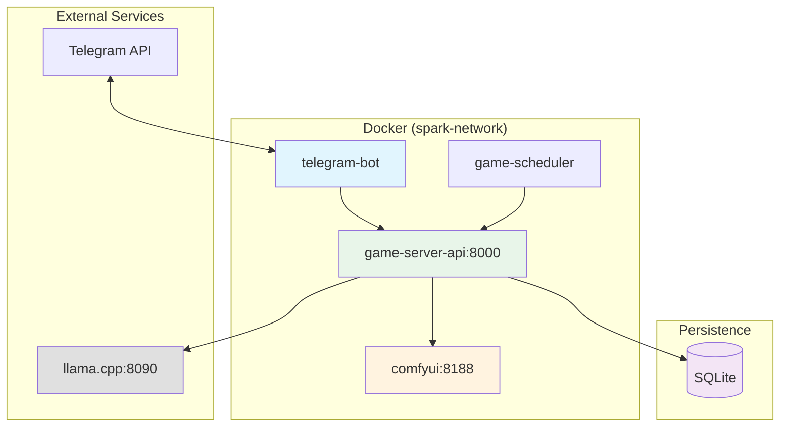

# Integration Guide

## Overview

This document describes all integration points in the AI Game Master system. The system consists of 4 services running in Docker containers, plus 2 external services, communicating via HTTP APIs.

## Architecture



## Service Communication Map

| Source | Target | Protocol | Port | Purpose |
|--------|--------|----------|------|---------|
| `telegram-bot` | `game-server-api` | HTTP (REST) | 8000 | Game state, onboarding, actions |
| `game-scheduler` | `game-server-api` | HTTP (REST) | 8000 | Trigger turn generation |
| `game-server-api` | `llama.cpp` | HTTP (OpenAI API) | 8090 | LLM calls for stories, dialogues, prompts |
| `game-server-api` | `comfyui` | HTTP (ComfyUI API) | 8188 | Image generation, workflow execution |
| `telegram-bot` | `Telegram API` | HTTPS (Bot API) | 443 | Send/receive messages |
| `game-server-api` | SQLite file | Local file I/O | — | Database persistence |

---

## 1. LLM Integration (OpenAI-compatible API)

**Files:** `game-server-api/game_master.py`

The Game Master Agent uses the OpenAI Python client to call any OpenAI-compatible endpoint (llama.cpp, vLLM, OpenAI API).

### Configuration

```python
# From environment variables
LLM_URL      = os.getenv("LLM_URL", "http://llama.cpp:8090/v1")
LLM_API_KEY  = os.getenv("LLM_API_KEY", "placeholder-key-for-llama-cpp")
LLM_MODEL    = os.getenv("LLM_MODEL", "unsloth/Qwen3.5-27B")
LLM_MAX_TOKENS = int(os.getenv("LLM_MAX_TOKENS", "32768"))
```

### Client Setup

```python
from openai import OpenAI

client = OpenAI(
    api_key=llm_api_key,
    base_url=llm_base_url,
)
```

### Structured Outputs

All LLM calls use `response_format` with JSON schema (Structured Outputs). Each game function uses a dedicated Pydantic schema:

| Schema | Usage | Description |
|--------|-------|-------------|
| `STORY_SCHEMA` | `generate_turn_story()` | Turn narrative + decision points |
| `NPC_DIALOGUE_SCHEMA` | `generate_npc_dialogues()` | NPC reactions |
| `CONTENT_PROMPTS_SCHEMA` | `generate_content_prompts()` | Image/video/comic prompts |
| `ONBOARDING_QUESTIONS_SCHEMA` | `generate_onboarding_questions()` | Dynamic onboarding quiz |
| `PLAYER_MESSAGE_SCHEMA` | `process_player_message()` | GM response to player |
| `AVATAR_PROMPT_SCHEMA` | Avatar prompt generation | Character image prompts |
| `ROLE_ASSIGNMENT_SCHEMA` | Role assignment (fallback) | Player role from answers |
| `SPECIES_GENDER_DESC_SCHEMA` | Species/gender description | Narrative character identity |
| `GAME_TITLE_SCHEMA` | Game title generation | Ship name + welcome text |
| `NPC_CHOICE_SCHEMA` | NPC choice selection | NPC action selection logic |
| `GLOBAL_CIRCUMSTANCES_SCHEMA` | Global game state | Shared turn circumstances |
| `PLAYER_BRIEFING_CHOICES_SCHEMA` | Personal briefings | Per-player narrative + choices |
| `COMBINED_OUTCOME_SCHEMA` | Turn outcome | Result of all player choices |

### Fallback Mechanism

When the endpoint does not support `response_format` (e.g., older llama.cpp versions), the system falls back to plain-text JSON extraction:

1. Try structured output with `response_format`
2. On failure, re-request with "Return ONLY valid JSON" instruction
3. Extract JSON block from response using regex
4. Parse with `json.loads()`

```python
def _call_llm(self, system_prompt, user_prompt, response_schema, ...):
    try:
        # Attempt structured output
        response = self.client.chat.completions.create(
            response_format=response_schema
        )
        return json.loads(response.choices[0].message.content)
    except Exception:
        # Fallback: ask for JSON in plain text
        response = self.client.chat.completions.create(...)
        return json.loads(self._strip_json_block(content))
```

### Thinking Disabled

All calls disable thinking via `chat_template_kwargs`:

```python
extra_body = {"chat_template_kwargs": {"enable_thinking": False}}
```

---

## 2. ComfyUI Integration (Image Generation)

**Files:** `game-server-api/image_generator.py`

Direct HTTP API integration for text-to-image generation using Z-Image Turbo model.

### Configuration

```python
COMFYUI_URL = os.getenv("COMFYUI_URL", "http://comfyui:8188")
```

### API Endpoints Used

| Endpoint | Method | Purpose |
|----------|--------|---------|
| `/prompt` | POST | Queue a workflow for execution |
| `/history/{prompt_id}` | GET | Poll for completion status |
| `/view` | GET | Retrieve generated image |
| `/` | GET | Health check (used by Docker) |

### Generation Flow

1. **Build Workflow** — Construct a JSON workflow for the Z-Image Turbo model
2. **Queue Prompt** — POST to `/prompt`, receive `prompt_id`
3. **Poll Completion** — GET `/history/{prompt_id}` with 2s interval, 180s timeout
4. **Extract URL** — Parse output images from completed workflow response

### Workflow Structure (Z-Image Turbo)

```python
# Models used:
#   UNET: z_image_turbo_bf16.safetensors
#   CLIP: qwen_3_4b.safetensors (type: lumina2)
#   VAE:  ae.safetensors
#
# Settings:
#   Steps: 8 (distilled model)
#   CFG: 1.0
#   Sampler: res_multistep
#   Scheduler: simple
#   Shift: 3.0 (AuraFlow sampling)
```

### Retry Logic

- 3 connection retries with exponential backoff (1s, 2s, 4s)
- 3 generation retries with 2s, 4s, 8s backoff
- Random seed on each retry (produces different image)

### Generation Types

| Method | Description | Default Size |
|--------|-------------|-------------|
| `generate_image()` | General-purpose generation | 1024×1024 |
| `generate_avatar_image()` | Character portrait | 768×1024 |
| `generate_scene_image()` | Scene/background | 1024×1024 |
| `generate_loading_images()` | Batch loading screens (10 prompts) | 768×768 |
| `generate_splash_images()` | Splash/landing screens (3 prompts) | 1024×768 |
| `generate_character_image()` | NPC character portrait | — |
| `generate_personalized_comic()` | Per-player comic scene | — |

### Fallbacks

When image generation fails, the system falls back to placeholder images:

- Splash: `DEFAULT_SPLASH_FALLBACK_URL` (configured in env)
- Loading: `DEFAULT_LOADING_FALLBACK_URL` (configured in env)
- Comics: `/content/comics/turn_{n}_placeholder.webp`

---

## 3. Game Server API (REST)

**Files:** `game-server-api/main.py`

FastAPI service on port 8000. All other services communicate through this API.

### Endpoint Categories

| Category | Prefix | Description |
|----------|--------|-------------|
| Onboarding | `POST /onboarding/*` | Player registration flow |
| Players | `GET /players/*` | Player profile and management |
| Game State | `GET /game/*` | Game state and turn episodes |
| Actions | `POST /game/actions` | Player action submission |
| Messages | `POST /game/messages` | Text/voice messages to GM |
| Admin | `POST /admin/*` | Episode and comic generation |
| Health | `GET /health` | Service health check |

### API Authentication

The API is internal to the Docker network and does not use authentication. In production, consider adding API keys or internal network restrictions.

### Error Format

All errors return standard HTTP status codes with JSON body:

```json
{
  "detail": "Error description"
}
```

---

## 4. Telegram Bot Integration

**Files:** `telegram-bot/bot.py`

The bot uses the python-telegram-bot library to interact with the Telegram Bot API.

### Configuration

```python
TELEGRAM_BOT_TOKEN    = os.getenv("TELEGRAM_BOT_TOKEN")
GAME_MASTER_API_URL   = os.getenv("GAME_MASTER_API_URL", "http://game-server-api:8000")
TELEGRAM_SOCKS_PROXY  = os.getenv("TELEGRAM_SOCKS_PROXY")  # Optional
```

### Commands

| Command | Description |
|---------|-------------|
| `/start` | Begin onboarding or return to game |
| `/profile` | Show player role and traits |
| `/turn` | View current turn's episode |
| `/help` | Show help information |

### Bot Features

- Interactive inline keyboards for action selection
- Voice message support (sent as messages to GM)
- Text chat with Game Master
- State machine (AI FSM DB) for onboarding flow

### API Calls to game-server-api

The bot makes HTTP requests to the Game Master API:

- `POST /onboarding/start` — Create onboarding session
- `POST /onboarding/{session_id}/answer` — Submit question answers
- `POST /onboarding/{session_id}/complete` — Finalize onboarding
- `GET /players/{player_id}/profile` — Get player info
- `GET /game/current-turn` — Get current turn's episode
- `GET /game/poll/{player_id}` — Check for updates
- `POST /game/actions` — Submit player choices
- `POST /game/messages` — Send messages to GM

---

## 5. Game Master Scheduler

**Files:** `game-scheduler/game_master.py`

A scheduled task runner that triggers turn episode generation.

### Configuration

```python
GAME_MASTER_API_URL = os.getenv("GAME_MASTER_API_URL", "http://game-server-api:8000")
GAME_SCHEDULE_TIME  = os.getenv("GAME_SCHEDULE_TIME", "08:00")  # UTC
GAME_MASTER_MODE    = os.getenv("GAME_MASTER_MODE", "scheduled")  # single | simulation | scheduled
```

### Modes

| Mode | Description |
|------|-------------|
| `scheduled` | Run at configured time daily |
| `single` | Run one generation cycle then exit |
| `simulation` | Generate with simulated player choices |

### API Calls

- `POST /admin/generate-turn` — Trigger new turn generation
- `GET /game/state` — Check current game state
- `GET /game/current-turn` — Verify generated content

---

## 6. Database Integration

**Files:** `game-server-api/database.py`

SQLite database for all persistent state.

### Database Tables

| Table | Purpose |
|-------|---------|
| `game_state` | Current game turn, status, timestamps |
| `player_profiles` | Player role, traits, avatar |
| `game_turns` | Turn episodes (story, NPC dialogues) |
| `player_actions` | Player choices per turn |
| `onboarding_sessions` | In-progress onboarding state |
| `game_messages` | Player message history |
| `onboarding_questions` | Generated question cache |
| `games` | Multi-game support |
| `npc_profiles` | NPC state and role assignments |
| `game_images` | Generated image URLs per game |

### Database Location

- Development: `./game-server-api/data/` directory (mounted volume)
- The SQLite file path is configurable via env variable

---

## 7. Docker Networking

**Network:** `spark-network` (external, must be created before startup)

```bash
docker network create spark-network
```

### Service Discovery

All services use Docker DNS for service discovery:

- `http://comfyui:8188` — ComfyUI
- `http://llama.cpp:8090/v1` — llama.cpp (external)
- `http://game-server-api:8000` — Game Master API

### Health Check Dependencies

```
llama.cpp (external) → game-server-api → telegram-bot
                                       → game-scheduler
                      comfyui → game-server-api
```

All inter-service dependencies use `condition: service_healthy`.

---

## 8. Required Libraries

| Package | Purpose | Version |
|---------|---------|---------|
| `fastapi` | REST API framework | ≥0.109.0 |
| `uvicorn` | ASGI server | ≥0.27.0 |
| `pydantic` | Data validation & schemas | ≥2.5.0 |
| `httpx` | HTTP client (bot → API) | ≥0.26.0 |
| `aiohttp` | Async HTTP client (API → ComfyUI) | ≥3.9.0 |
| `openai` | OpenAI-compatible LLM client | ≥1.30.0 |
| `python-multipart` | File upload support | ≥0.0.6 |

---

## 9. Environment Variables

| Variable | Default | Service | Description |
|----------|---------|---------|-------------|
| `LLM_URL` | `http://llama.cpp:8090/v1` | game-server-api | LLM endpoint |
| `LLM_API_KEY` | `placeholder-key-for-llama-cpp` | game-server-api | API key (required by client) |
| `LLM_MODEL` | `unsloth/Qwen3.5-27B` | game-server-api | Model name |
| `LLM_MAX_TOKENS` | `32768` | game-server-api | Max tokens per LLM call |
| `COMFYUI_URL` | `http://comfyui:8188` | game-server-api | Image generation endpoint |
| `TELEGRAM_BOT_TOKEN` | _(required)_ | telegram-bot | Telegram bot token from @BotFather |
| `GAME_MASTER_API_URL` | `http://game-server-api:8000` | telegram-bot, game-scheduler | API URL |
| `GAME_SCHEDULE_TIME` | `08:00` | game-scheduler | Daily generation time (UTC) |
| `GAME_MASTER_MODE` | `scheduled` | game-scheduler | Run mode |
| `ONBOARDING_QUESTIONS_COUNT` | `5` | game-server-api | Questions per onboarding |
| `ONBOARDING_OPTIONS_COUNT` | `5` | game-server-api | Options per question |
| `AI_FSM_DB` | `./bot_storage.db` | telegram-bot | Bot state database path |
| `TELEGRAM_SOCKS_PROXY` | — | telegram-bot | Optional SOCKS5 proxy |

---

## 10. Troubleshooting

### Connection Failures

```bash
# Verify service is running
docker compose ps

# Check service logs
docker compose logs game-server-api
docker compose logs comfyui
docker compose logs telegram-bot

# Check network connectivity
docker compose exec telegram-bot ping game-server-api
docker compose exec game-server-api curl http://comfyui:8188/
docker compose exec game-server-api curl http://llama.cpp:8090/v1/models
```

### ComfyUI Issues

```bash
# Check ComfyUI health
curl http://localhost:8188/

# View ComfyUI logs
docker compose logs comfyui

# Verify GPU available
nvidia-smi
```

### LLM API Issues

```bash
# Check if llama.cpp is accessible
curl http://llama.cpp:8090/v1/models

# Verify model is loaded (check llama.cpp logs)
docker logs llama.cpp  # external service
```

### Generation Failures

- Image generation fails → falls back to placeholder images
- LLM structured output fails → falls back to plain-text JSON extraction
- All failures are logged with error details
